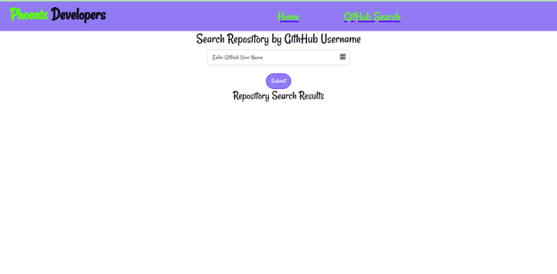

# GitHub Search Web Application
#### This is a web application where the users search public git hub repositories by username.
#### By **Nyambura Kelvin Njuguna**

## Description.
* This is a Web application were users can simply enter and submit a github username and see all public repositories associated to that username.

## Application Page Design.

## Setup/Installation Requirements.
* Install Google Chrome on your machine.
* Have nodejs installed on the computer/laptop.
* Have angular CLI installed
* 

## Live link.
https://kevson102.github.io/Github-Search/

## Known Bugs
* NONE

## BDD
1. The application accepts the user inputs via a form
2. If the name entered matches that of any github user, the web application displays all the public repositories associated to that username
3. The user can see the number of days elapsed since the Web app was published
4. The user can view a descriptive profile of the app developer, including their github username, profile picture, and some of the repositories that the user have created.

## Build

Run `ng build` to build the project. The build artifacts will be stored in the `dist/` directory.

## Development server

Run `ng serve` for a dev server. Navigate to `http://localhost:4200/`. The app will automatically reload if you change any of the source files.

## Technologies Used
1. HTML
2. CSS
3. Angular
## Support and contact details
* Email: Kevson3941@gmail.com
* Phone no. +254 733 916258
### License
<a href="LICENSE.MD" target = "_blank">MIT</a>

Copyright (c) 2021 **GitHub Search Web Application-Nyambura Kelvin Njuguna**
